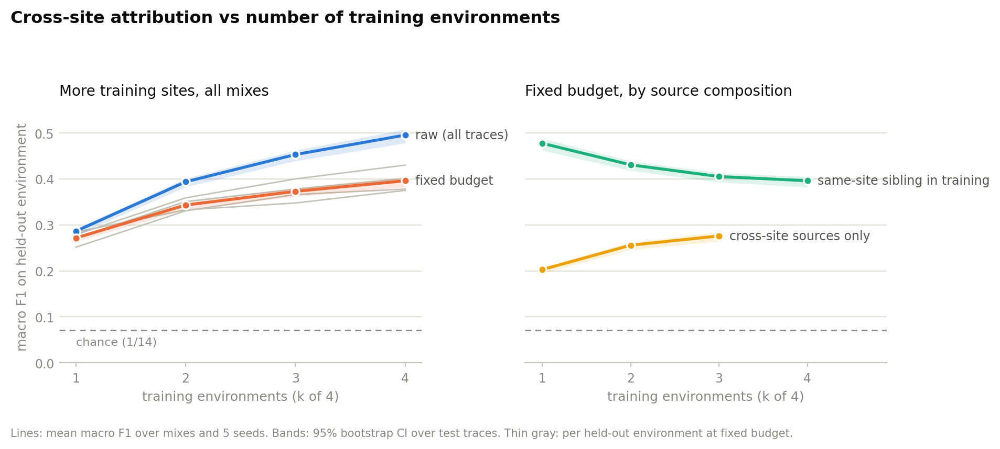

# agent-attribution-eval

My reproduction and extension of:

> Lugoloobi, Marro, Magomere, Wright, Russell.
> Known By Their Actions: Fingerprinting LLM Browser Agents via UI Traces.
> [arXiv:2605.14786](https://arxiv.org/abs/2605.14786), 2026. Code and data: [github.com/KabakaWilliam/known_actions](https://github.com/KabakaWilliam/known_actions)

The paper identifies which of 14 llms is driving a browser agent using passive UI traces (up to 96% per agent F1 in domain). I reimplemented the pipeline and checked it against the released artifacts. I then tested whether the fingerprint is transferable across sites, on unknown agents, and on newer model versions. Full results in [REPORT.md](REPORT.md).

## Findings

**Reproduction** ([secs. 1](REPORT.md#1-reproduction-vs-published-numbers) & [2](REPORT.md#2-data-splits-and-features-what-verification-found))
The pipeline reproduces the published results within about 1pp everywhere across the checks I ran.  
  - 39/41 features match the reference extractor exactly
  - In-domain macro F1 is within 1.2pp of the paper. On the 4th benchmark, the gap is +0.7pp with their selected params
  - Transfer cells have a mean delta of 0.60pp and all 56 unseen agent fold counts match
  
**Metric framing** ([sec. 3](REPORT.md#3-metric-choice-on-one-confusion-matrix))
The 96% figure is the best agent's score, from the same confusion matrix that scored 46.8 for the worst agent
  - Across the 14 agents, macro F1 peaked at 80.5. The worst agent is at 46.8 with 7.1 by chance 

**Open set** ([sec. 4](REPORT.md#4-open-set-evaluation-with-error-rate-metrics))
At a usable alert rate, the detector catches few of the agents it wasn't trained on.
  - AUROC is around 0.7, but at a 1% false alert rate, the detector misses 97% of unknown agent traces. 
  - Unknown agents with a family sibling in training aren't consistently harder to detect.

**Site scaling** ([sec. 5](REPORT.md#5-does-cross-site-attribution-improve-with-more-training-sites))
More training sites help, but only by about 7pp, which isn't enough to say the fingerprint is site-independent. 
  - After controlling for training volume and the mix of related agents, adding more sites raises cross-site macro F1 from 20.3 to 27.6 (chance is 7.1). 
  - A new site only seems to help if its interaction pattern is similar to the target site. 

**Split record** ([sec. 6](REPORT.md#2-data-splits-and-features-what-verification-found))
The released FRAMES split record was made with a weaker trace filter than training, so it doesn't describe the split used for  the released models.
  - Both split variants can be reproduced exactly

**Replication drift** ([sec. 7](REPORT.md#7-extension-attempt-newer-claude-versions-through-the-original-harness))
New models change faster than the harnesses used to benchmark them, so these setups have a short life.
  - Four months after the authors collected their traces, I couldn't get usable ones out of their own harness. The harness, API surface, serving path, bot detection, and model behavior all changed.
  - The attempt scored lower than my preregistered reporting threshold, so I don't report any classifier results for it. 

<picture>
  <source media="(prefers-color-scheme: dark)" srcset="results/figures/site_scaling_dark.png">
  
</picture>

## Run

  python3 -m venv .venv && .venv/bin/pip install -r requirements.txt
  .venv/bin/python fetch_data.py             # 184 MB, sha256-verified
  .venv/bin/python features.py
  .venv/bin/python features.py --validate
  .venv/bin/python train.py
  .venv/bin/python evaluate.py               # or --analysis metrics|transfer|openset|scaling

Deterministic given `config.yaml`. About an hour on an 8-core laptop, mostly `openset` (56 fits, each with the paper's 40-draw search) and `scaling` (600 fits).

## Layout

  config.yaml         every path, seed, and hyperparameter
  paper_numbers.yaml  published numbers, typed from the paper
  common.py           trace loading and the paper's split protocol
  fetch_data.py       download, checksum, unpack, Table 1 checks
  features.py         the 41 Table 8 features, from the spec
  train.py            closed-set XGBoost on the published splits
  evaluate.py         metrics / transfer / openset / scaling
  ext_proxy.py        usage-recording proxy for re-collection
  ext_collect.py      trace collection for newer Claude versions (REPORT sec. 7)
  REPORT.md           reproduction deltas and findings
  results/            committed outputs (CSVs, figures)
